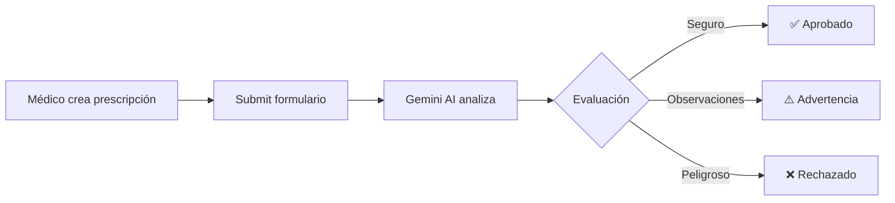

# 🏥 MediScript - Sistema de Prescripción Médica con IA

Sistema inteligente de prescripción médica que utiliza **Google Gemini AI** para analizar y validar prescripciones en tiempo real, garantizando la seguridad del paciente.


---

## ✨ Características

### 🤖 Análisis Inteligente con IA
- **Validación de alergias** con detección de reacciones cruzadas
- **Interacciones medicamentosas** entre medicamentos prescritos y actuales
- **Dosificación apropiada** según peso, edad y condición del paciente
- **Contraindicaciones** basadas en historial médico completo
- **Recomendaciones** y sugerencias de alternativas seguras

### 📋 Gestión Completa
- Formulario intuitivo de prescripción médica
- Historial completo del paciente
- Alertas visuales de alergias graves
- Soporte para múltiples medicamentos
- Sistema de scoring (0-100) de seguridad

### 🎯 Tres Niveles de Validación
- ✅ **Aprobado** - Prescripción segura
- ⚠️ **Advertencia** - Requiere atención
- ❌ **Rechazado** - Requiere corrección

---

## 🚀 Inicio Rápido

### 1. Instalación

```bash
# Clonar repositorio
git clone <tu-repo-url>
cd prescrible-form

# Instalar dependencias
npm install
```

### 2. Configurar API Key (100% Gratis)

```bash
# Crear archivo de configuración
echo "VITE_GEMINI_API_KEY=tu_api_key_aqui" > .env.local
```

**Obtener API Key:**
1. Ve a https://aistudio.google.com/app/apikey
2. Crea API Key en proyecto nuevo
3. Copia y pega en `.env.local`

📖 **Ver guía completa:** [SETUP.md](./SETUP.md)

### 3. Ejecutar

```bash
npm run dev
```

Abre http://localhost:5173 🎉

---

## 🤖 Cómo Funciona el Agente



### El Agente Analiza:

1. **Alergias del Paciente**
   - Compara medicamentos con alergias conocidas
   - Detecta reactividad cruzada (ej: Penicilina → Amoxicilina)
   - Evalúa severidad de las alergias

2. **Interacciones Medicamentosas**
   - Entre medicamentos prescritos
   - Con medicación actual del paciente
   - Riesgos: sangrado, sedación, QT prolongado

3. **Dosificación**
   - Según edad (pediatría/geriatría)
   - Según peso corporal (mg/kg)
   - Ajustes para condiciones especiales

4. **Contraindicaciones**
   - Basado en antecedentes médicos
   - Condiciones crónicas activas
   - Efectos adversos previos

### Resultado:
- **Score de seguridad** (0-100)
- **Estado** (Aprobado/Advertencia/Rechazado)
- **Hallazgos detallados** por categoría
- **Recomendaciones específicas**
- **Alternativas** si es necesario

---

## 📊 Ejemplo de Análisis

### Caso: Amoxicilina a paciente alérgica a Penicilina

```json
{
  "status": "rejected",
  "overallScore": 20,
  "criticalAlerts": [
    "⚠️ CONTRAINDICACIÓN ABSOLUTA: Amoxicilina es beta-lactámico"
  ],
  "findings": {
    "allergies": {
      "safe": false,
      "issues": ["Paciente alérgica a Penicilina con severidad grave"],
      "suggestions": ["Considerar Azitromicina 500mg", "Usar macrólidos"]
    }
  }
}
```

---

## 🛠️ Tecnologías

| Categoría | Stack |
|-----------|-------|
| **Frontend** | React 18 + TypeScript + Vite |
| **UI** | shadcn/ui (Radix UI + Tailwind CSS) |
| **Forms** | React Hook Form + Zod |
| **IA** | Google Gemini 1.5 Flash (optimizado, 100% gratis) |
| **Icons** | Lucide React |
| **Notifications** | Sonner |

---

## 📁 Estructura del Proyecto

```
src/
├── components/
│   ├── PrescriptionForm.tsx       # Formulario principal
│   ├── PrescriptionAnalysis.tsx   # Visualización del análisis IA
│   └── ui/                        # Componentes shadcn/ui
├── services/
│   └── prescriptionAgent.ts       # Integración con Gemini AI
├── data/
│   ├── medications.json           # Catálogo de 10 medicamentos
│   └── patients.json              # 3 pacientes de ejemplo
└── pages/
    └── Index.tsx                  # Página principal
```

---

## 🧪 Casos de Prueba

### Prueba 1: Prescripción Segura ✅
- **Paciente:** Andrés Ramírez (13 años, sin alergias)
- **Medicamento:** Paracetamol 500mg, oral, cada 8h
- **Resultado esperado:** ✅ Aprobado (Score ~90)

### Prueba 2: Alergia Crítica ❌
- **Paciente:** María González (alérgica a Penicilina)
- **Medicamento:** Amoxicilina 500mg
- **Resultado esperado:** ❌ Rechazado con alternativas

### Prueba 3: Interacción Medicamentosa ❌
- **Paciente:** Carlos Vargas (toma Warfarina)
- **Medicamento:** Ibuprofeno 400mg
- **Resultado esperado:** ❌ Rechazado (riesgo sangrado + alergia)

---

## 💰 Costos

**100% GRATIS** ✨

| Concepto | Límite Gratuito (Gemini 1.5 Flash) |
|----------|-------------------------------------|
| Requests por minuto | 15 RPM |
| Requests por día | 1,500 RPD |
| Tokens de entrada | 1M por día |
| Tokens de salida | Optimizado a 2,048 por request |
| Costo | $0 |
| Tarjeta requerida | NO |

---

## 🔒 Seguridad

- ✅ API Key en `.env.local` (no se sube a Git)
- ✅ Datos de pacientes simulados (JSON local)
- ✅ Sin backend (ideal para demos)
- ⚠️ **Producción:** Implementar backend seguro

---

## 🚨 Troubleshooting

### Error: "API Key no configurada"
```bash
# Verificar que .env.local existe
cat .env.local

# Debe mostrar:
VITE_GEMINI_API_KEY=AIzaSy...

# Reiniciar servidor
npm run dev
```

### Error: "No se encontraron modelos disponibles"
- Tu API Key no tiene permisos
- Solución: Crea nueva API Key en **proyecto nuevo**
- https://aistudio.google.com/app/apikey

### El análisis no funciona
1. Abre DevTools (F12)
2. Ve a Console
3. Busca errores en rojo
4. Verifica que veas: "✅ Modelos disponibles: [...]"

---

## 🎓 Explicación Técnica

### Detección Automática de Modelos

El código detecta automáticamente qué modelos de Gemini tienes disponibles:

```typescript
// 1. Lista modelos disponibles con tu API Key
const availableModels = await listAvailableModels();

// 2. Selecciona el mejor modelo disponible
const selectedModel = availableModels.filter(
  m => m.includes('1.5-flash') || m.includes('pro')
)[0];

// 3. Usa ese modelo automáticamente
const model = genAI.getGenerativeModel({ model: selectedModel });
```

Esto hace que el código sea **adaptativo** y funcione con cualquier API Key válida.

---

## 📚 Documentación

- **[SETUP.md](./SETUP.md)** - Guía de configuración completa
- **Código fuente** - Todo comentado y tipado con TypeScript

---

## 🌟 Roadmap

- [ ] Backend con autenticación JWT
- [ ] Base de datos PostgreSQL
- [ ] Generación de PDF
- [ ] Firma digital médica
- [ ] Integración con bases de datos farmacológicas
- [ ] Historial de prescripciones
- [ ] Búsqueda avanzada de pacientes
- [ ] API REST para integración

---

## 📝 Licencia

Este proyecto está bajo licencia MIT. Ver [LICENSE](./LICENSE) para más detalles.

---

## 🤝 Contribuciones

Las contribuciones son bienvenidas! Por favor:

1. Fork el proyecto
2. Crea tu rama (`git checkout -b feature/AmazingFeature`)
3. Commit tus cambios (`git commit -m 'Add AmazingFeature'`)
4. Push a la rama (`git push origin feature/AmazingFeature`)
5. Abre un Pull Request

---

## 💡 Notas Importantes

- **Este es un sistema de apoyo a decisiones médicas**
- **La decisión final es responsabilidad del profesional médico**
- **Los datos de pacientes son ficticios** (para demostración)
- **Para uso en producción**: Implementar backend, autenticación y base de datos real

---

## 🎯 Autor

Desarrollado con ❤️ usando React, TypeScript y Google Gemini AI

**¿Preguntas o sugerencias?** Abre un issue en GitHub

---

## 🔗 Enlaces Útiles

- [Google AI Studio](https://aistudio.google.com/)
- [Gemini API Docs](https://ai.google.dev/docs)
- [shadcn/ui](https://ui.shadcn.com/)
- [React Hook Form](https://react-hook-form.com/)
- [Zod Validation](https://zod.dev/)

---

<p align="center">
  <strong>⭐ Si te gustó este proyecto, déjanos una estrella en GitHub ⭐</strong>
</p>

<p align="center">
  Hecho con 🏥 para mejorar la seguridad en prescripciones médicas
</p>
